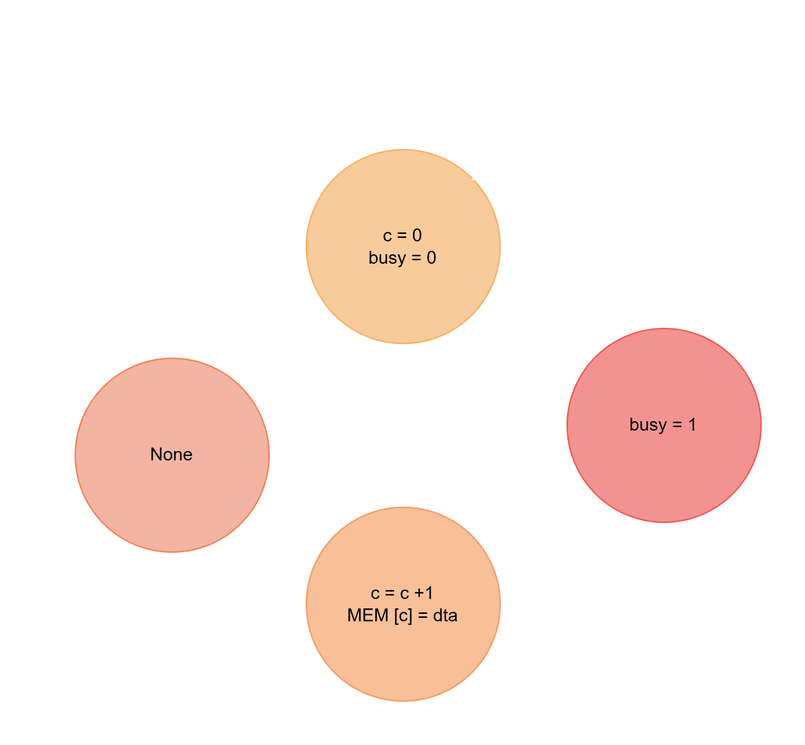

# :loud_sound: Module I2S fpga Colorlight5A-75E
Código fuente de verilog: [module/i2s.v](module/i2s.v) <br>
Código C litex: [hellow_world/main.c](hellow_world/main.c) <br>
Carga y ajuste de la canción: [to_hex.c](to_hex.c) y [mod_wav.py](mod_wav.py) <br>

## Module I2S - Verilog
El modulo en verilog que es el archivo llamado [i2s.v](module/i2s.v), tiene 3 parametros, 4 salidas y 4 entradas.

```verilog

module i2s #(
	parameter          freq_hz = 60000000,
	parameter          resolution = 16,
    	parameter          freq_music = 13000
) (
	input              rst,
	input              clk,

	output reg         sck,
	output reg         sd,
  	output reg         ws,

	input      [15:0]  dta,
  	input              init,
	output reg         busy
);

```
Los parametros son usados para calcular el numero de ciclos necesarios en el divisor de frecuencia, ese calculo se hace con la siguiente formula donde en el numerador se encuentra la frecuencia de reloj de la tarjeta, en el denominador la frecuencia deseada, la resolucion que en nuestro caso es de 16 bits, tambien un 2 indicando que son dos canales por lo que es estereo y otro 2 para que la frecuencia no sea la mitad.


$$divisor=N_{ciclos}=\frac{F_{clk}}{F_{muestreo}\cdot 16 \cdot 2 \cdot 2}$$


```verilog
parameter divisor = freq_hz/freq_music/resolution/4;
```
Para sincronizar los tiempos de escritura por parte del CPU y la reproducción del audio del módulo, se creó una pseudo-memoria que almacena 511 registros de 16 bits, es decir, 1 KB. La CPU puede escribir a la velocidad que desee, y el módulo va accediendo a esta memoria a su propia frecuencia. De esta manera, la CPU no debe sincronizar los tiempos del módulo, lo que implicaría calcular retardos muy precisos.

```verilog
reg [15:0] MEM [0:511]; 
```
A continuacion el diagrama de flujo que describe el comportamiento de la escritura en memoria.

<p align="center">
  
</p>
<p align="center">
  <em> Diagrama de estados de la escritura en la memoria temporal </em>
</p>

En el modulo principal encargado de las señales de salida encontramos un divisor de frecuencia que genera la señal <ins>sck</ins>, apartir de los ciclos de esta señal se va enviando por <ins>sd</ins> el bit mas significativo de cada dato en la memoria, cada 16 bits se invierte la señal de <ins>ws</ins>, ya que se debe mandar los valores para el canal izquierdo y derecho.
